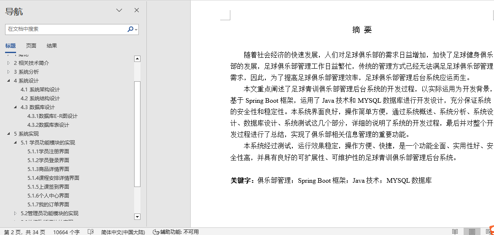
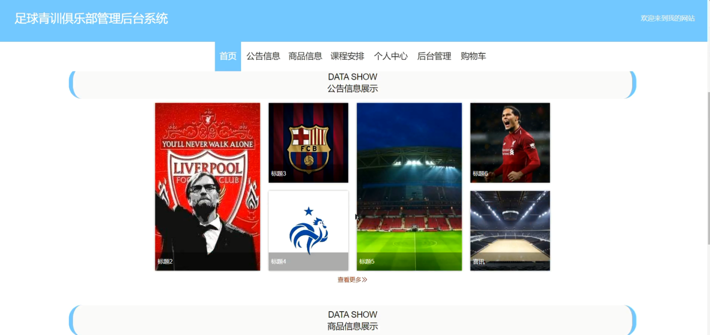
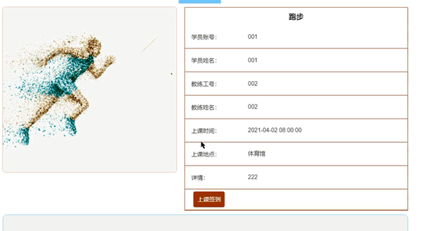
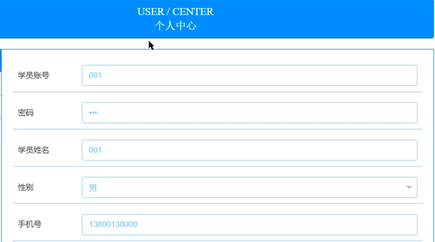
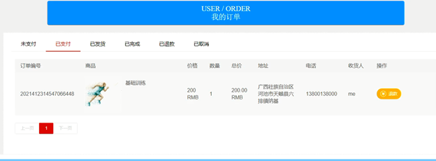
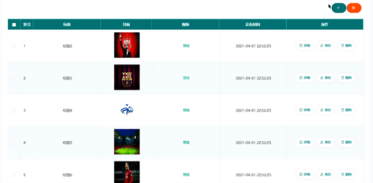
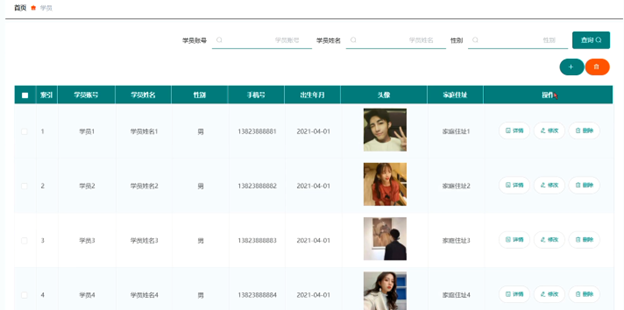
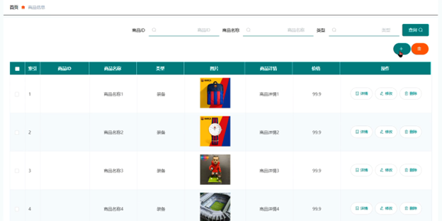
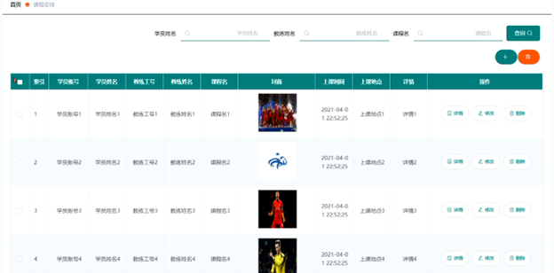
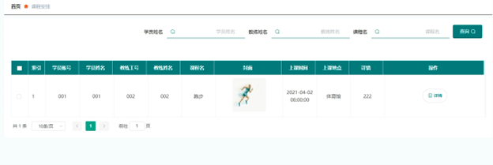

## 基于Web足球青训俱乐部管理后台系统(程序+报告)

###  获取sql数据库文件: 从戎源码网 (https://armycodes.com/) QQ: 386869957 QQ群: 377586148
###  所有系统地址: (https://github.com/YuLin-Coder/AllProjectCatalog) 
###  所有项目以及源代码本人均调试运行无问题 可支持远程安装部署调试、定制修改、代码讲解

## 项目介绍
基于Web足球青训俱乐部管理后台系统，系统包含两种角色：用户、管理员，系统分为前台和后台两大模块，主要功能如下：

1 学员功能模块的实现

学员注册界面
未有账号的学员可进入注册界面进行注册操作。

学员登录界面
学员要想进行商品购买操作，必须登录系统。

商品详情界面
学员在商品详情界面可查看商品详细信息，登录后可加入购物车或者立即购买。

课程安排详情界面
学员可选择课程安排查看详情信息，登录后可进行上课签到操作。

上课签到界面
学员登录后可进行上课签到操作。

个人中心界面
学员登录后可对个人信息进行管理。

我的订单界面
学员可进入我的订单界面查看个人已有订单信息。

2 管理员功能模块的实现

管理员登录界面
管理员要进入系统后台进行管理操作，必须登录系统。

公告信息管理界面
管理员可增删改查公告信息。

学员管理界面
管理员可查看、添加、修改和删除学员信息。

商品信息管理界面
管理员可增删改查商品信息。

课程安排管理界面
管理员可添加、修改和删除课程安排信息。

3 教练功能模块的实现

课程安排界面
教练登录后可查看课程安排信息。

课程签到管理界面
教练可查看学员课程签到信息，并可对其进行审核操作。

## 项目技术
- 编程语言：Java
- 数据库：MySQL
- 项目管理工具：Maven
- 前端技术：HTML、CSS、JavaScript、Jquery、Vue
- 后端技术：Spring、SpringMVC、MyBatis

## 运行环境
- JDK版本：JDK1.8及以上
- 开发工具：IDEA、Ecplise、Myecplise都可以
- 数据库: MySQL5.7及以上
- Maven：maven3.0及以上
- Node：14.14.0及以上

## 运行截图

